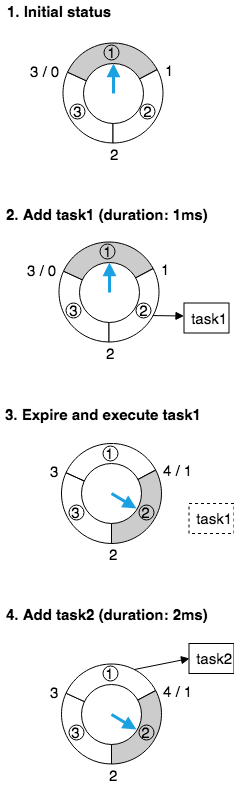
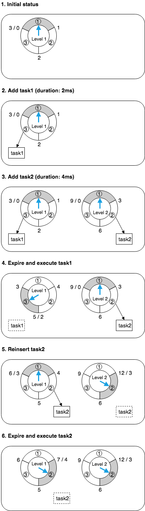
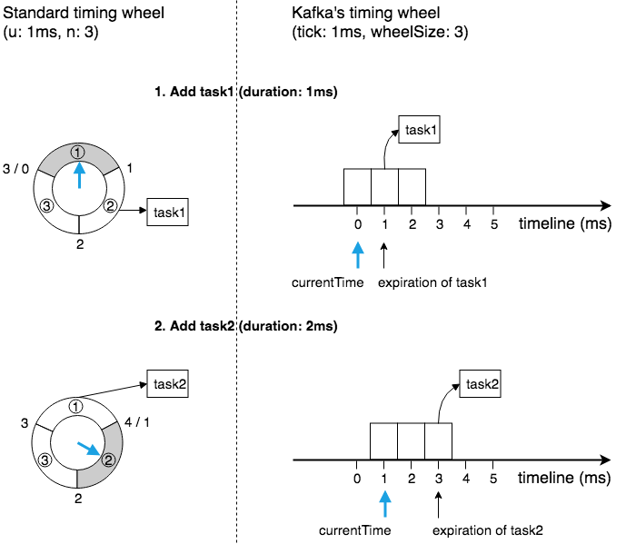
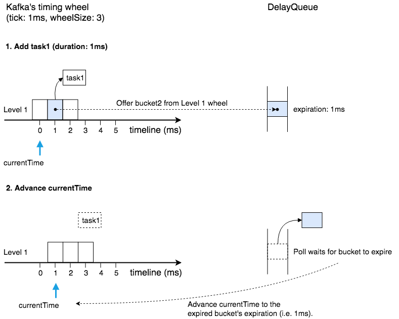

# 层级时间轮的 Golang 实现

## 一、引言

最近在工作中负责制定重构计划，需要将部分业务代码从 Python 迁移到 Golang。其中一些功能涉及到 Celery 延时任务，所以一直在思考 Golang 中处理延时任务的有效方案。

其实在软件系统中，“在一段时间后执行一个任务” 的需求比比皆是。比如：

* 客户端发起 HTTP 请求后，如果在指定时间内没有收到服务器的响应，则自动断开连接。

为了实现上述功能，通常我们会使用定时器 Timer：

1. 客户端发起请求后，立即创建（启动）一个 Timer：到期间隔为 d，到期后执行 “断开连接” 的操作。

2. 如果到期间隔 d 以内收到了服务器的响应，客户端就删除（停止）这个 Timer。

3. 如果一直没有收到响应，则 Timer 最终会到期，然后执行 “断开连接” 的操作。

Golang 内置的 Timer 是采用最小堆来实现的，创建和删除的时间复杂度都为 O(log n)。现代的 Web 服务动辄管理 100w+ 的连接，每个连接都会有很多超时任务（比如发送超时、心跳检测等），如果每个超时任务都对应一个 Timer，性能会比较低下。

论文 [Hashed and Hierarchical Timing Wheels]( doc/ton97-timing-wheels.pdf) 提出了一种用于实现 Timer 的高效数据结构：时间轮。采用时间轮实现的 Timer，创建和删除的时间复杂度为 O(1)。

常见的时间轮实现有两种：

* 简单时间轮（Simple Timing Wheel）—— 比如 Netty4 的 [HashedWheelTimer](https://netty.io/4.0/api/io/netty/util/HashedWheelTimer.html)。
* 层级时间轮（Hierarchical Timing Wheels）—— 比如 Kafka 的 [Purgatory](https://www.confluent.io/blog/apache-kafka-purgatory-hierarchical-timing-wheels/)。

参考 Kafka 的层级时间轮实现（基于 Java/Scala 语言），我依葫芦画瓢实现了一个 Golang 版本的层级时间轮，实现源码作为个人项目放到了 [https://github.com/chenyang1836/](https://github.com/chenyang1836/)。

下面我们来看看简单时间轮、层级时间轮、Kafka 的层级时间轮变体的实现原理，以及 Golang 实现中的一些要点。

##  二、简单时间轮

一个 __简单时间轮__ 就是一个循环列表，列表中的每一格包含一个定时任务列表（双向链表）。一个时间单位为 u、大小为 n 的简单时间轮，可以包含的定时任务的最大到期间隔为 n*u。

以 u 为 1ms、n 为 3 的简单时间轮为例，可以包含的定时任务的最大到期间隔为 3ms。

如上图所示，该简单时间轮的运行原理如下：

1. 初始时，假设当前时间（蓝色箭头）指向第 1 格（此时：到期间隔为 [0ms, 1ms) 的定时任务放第 1 格，[1ms, 2ms) 的放第 2 格，[2ms, 3ms) 的放第 3 格）。
2. 此时我们创建一个到期间隔为 1ms 的定时任务 task1，按规则该任务会被插入到第 2 格。
3. 随着时间的流逝，过了 1ms 后当前时间指向第 2 格，这一格包含的定时任务 task1 会被删除并执行。
4. 当前时间指向第 2 格（此时：到期间隔为 [0ms, 1ms) 的定时任务放第 2 格，[1ms, 2ms) 的放第 3 格，[2ms, 3ms) 的放第 1 格），我们继续创建一个到期间隔为 2ms 的定时任务 task2，按规则该任务被插入到第 1 格。

简单时间轮的优点是实现简单，缺点是：

* 一旦选定 n，就不能包含到期间隔超过 n*u 的定时任务。
* 如果定时任务的到期时间跨度较大，就会选择较大的 n，在定时任务较少时会造成很大的空间浪费。

有一些简单时间轮的 变体实现，它们通过在定时任务中增加记录 round 轮次信息，可以有效弥补上述两个缺点。同样以上面 u 为 1ms、n 为 3 的简单时间轮为例，初始时间指向第 1 格；此时如果要创建到期时间为 4ms 的定时任务，可以在该任务中设置 round 为 1（4/3 取整），剩余到期时间用 4ms 减去 round*3ms 等于 1ms，因此放到第 2 格；等到当前时间指向第 2 格时，判断任务中的 round 大于 0，所以不会删除并执行该任务，而是对其 round 减一（于是 round 变为 0）；等到再过 3ms 后，当前时间再次指向第 2 格，判断任务中的 round 为 0，进而删除并执行该任务。

然而，这些变体实现因为只使用了一个时间轮，所以仍然存在一个缺点：处理每一格的定时任务列表的时间复杂度是 O(n)，如果定时任务数量很大，分摊到每一格的定时任务列表就会很长，这样的处理性能显然是让人无法接受的。

## 三、层级时间轮

__层级时间轮__ 通过使用多个时间轮，并且对每个时间轮采用不同的 u，可以有效地解决简单时间轮及其变体实现的问题。

参考 Kafka 的 [Purgatory](https://www.confluent.io/blog/apache-kafka-purgatory-hierarchical-timing-wheels/) 中的层级时间轮实现：

* 每一层时间轮的大小都固定为 n，第一层时间轮的时间单位为 u，那么第二层时间轮（我们称之为第一层时间轮的溢出时间轮 Overflow Wheel）的时间单位就为 n*u，以此类推。
* 除了第一层时间轮是固定创建的，其他层的时间轮（均为溢出时间轮）都是按需创建的。
* 原先插入到高层时间轮（溢出时间轮）的定时任务，随着时间的流逝，会被降级重新插入到低层时间轮中。

以 u 为 1ms、n 为 3 的层级时间轮为例，第一层时间轮的时间单位为 1ms、大小为 3，第二层时间轮的时间单位为 3ms、大小为 3，以此类推。

如上图所示，该层级时间轮的运行原理如下：

1. 初始时，只有第一层（Level 1）时间轮，假设当前时间（蓝色箭头）指向第 1 格（此时：到期间隔为 [0ms, 1ms) 的定时任务放第 1 格，[1ms, 2ms) 的放第 2 格，[2ms, 3ms) 的放第 3 格）。
2. 此时我们创建一个到期间隔为 2ms 的定时任务 task1，按规则该任务会被插入到第一层时间轮的第 3 格。
3. 同一时刻，我们再次创建一个到期间隔为 4ms 的定时任务 task2，因为到期间隔超过了第一层时间轮的间隔范围，所以会创建第二层（Level 2）时间轮；第二层时间轮中的当前时间（蓝色箭头）也指向第 1 格，按规则该任务会被插入到第二层时间轮的第 2 格。
4. 随着时间的流逝，过了 2ms 后，第一层时间轮中的当前时间指向第 3 格，这一格包含的任务 task1 会被删除并执行；此时，第二层时间轮的当前时间没有变化，依然指向第 1 格。
5. 随着时间的流逝，又过了 1ms 后，第一层时间轮中的当期时间指向第 1 格，这一格中没有任务；此时，第二层当前时间指向第 2 格，这一格包含的任务 task2 会被删除并重新插入时间轮，因为剩余到期时间为 1ms，所以 task2 会被插入到第一层时间轮的第 2 格。
6. 随着时间的流逝，又过了 1ms 后，第一层时间轮中的当前时间指向第 2 格，这一格包含的定时任务 task2 会被删除并执行；此时，第二层时间轮的当前时间没有变化，依然指向第 2 格。

## 四、Kafka 的变体实现

在具体实现层面（参考 [Kafka Timer 实现源码](https://github.com/apache/kafka/tree/3cdc78e6bb1f83973a14ce1550fe3874f7348b05/core/src/main/scala/kafka/utils/timer)），Kafka 的层级时间轮与上面描述的原理有一些差别。

### 时间轮表示

如上图所示，在时间轮的表示上面：

* 使用大小为 wheelSize 的数组来表示一层时间轮，其中每一格是一个 bucket，每个 bucket 的时间单位为 tick。
* 这个时间轮数组并没有模拟循环列表的行为（如图左所示），而是模拟了哈希表的行为。具体而言（如图右所示），这个时间轮数组会随着 currentTime 的流逝而移动，也就是说 currentTime 永远是指向第一个 bucket 的，每个落到该时间轮的定时任务，都会根据哈希函数 (expiration/tick)%wheelSize 散列到对应的 bucket 中（参考 [源码](https://github.com/apache/kafka/blob/3cdc78e6bb1f83973a14ce1550fe3874f7348b05/core/src/main/scala/kafka/utils/timer/TimingWheel.scala#L135-L138)）。

### 时钟驱动方式

常规的时间轮实现中，会在一个线程中每隔一个时间单位 tick 就醒来一次，并驱动时钟走向下一格，然后检查这一格中是否包含定时任务。如果时间单位 tick 很小（比如 Kafka 中 tick 为 1ms）并且（在最低层时间轮的）定时任务很少，那么这种驱动方式将会非常低效。

Kafka 的层级时间轮实现中，利用了 Java 内置的 DelayQueue 结构，将每一层时间轮中所有 “包含有定时任务的 bucket” 都加入到同一个 DelayQueue 中（参考 源码），然后 等到有 bucket 到期后再驱动时钟往前走（参考 源码），并逐个处理该 bucket 中的定时任务（参考 [源码](https://github.com/apache/kafka/blob/3cdc78e6bb1f83973a14ce1550fe3874f7348b05/core/src/main/scala/kafka/utils/timer/Timer.scala#L111)）。

如上图所示：

1. 往层级时间轮中添加一个定时任务 task1 后，会将该任务所属的 bucket2 的到期时间设置为 task1 的到期时间 expiration（= 当前时间 currentTime + 定时任务到期间隔 duration），并将这个 bucket2 添加（Offer）到 DelayQueue 中。
2. DelayQueue（内部有一个线程）会等待 “到期时间最早（earliest）的 bucket” 到期，图中等到的是排在队首的 bucket2，于是经由 poll 返回并删除这个 bucket2；随后，时间轮会将当前时间 currentTime 往前移动到 bucket2 的 expiration 所指向的时间（图中是 1ms 所在的位置）；最后，bucket2 中包含的 task1 会被删除并执行。

上述 Kafka 层级时间轮的驱动方式是非常高效的。虽然 DelayQueue 中 offer（添加）和 poll（获取并删除）操作的时间复杂度为 O(log n)，但是相比定时任务的个数而言，bucket 的个数其实是非常小的（也就是 O(log n) 中的 n 很小），因此性能也是没有问题的。

## 五、Golang 实现要点

[timingwheel](https://github.com/chenyang1836/timingwheel) 中的 Golang 实现，基本上都是参考 Kafka 的层级时间轮的原理来实现的。

因为 Golang 中没有现成的 DelayQueue 结构，所以自己实现了一个 [DelayQueue](http://git.qxtv1.com/st52/timingwheel)，其中：

* PriorityQueue —— 从 [NSQ](https://nsq.io/) 借用过来的 优先级队列（基于最小堆实现）。
* DelayQueue —— Offer（添加 bucket）和 Poll（获取并删除 bucket）的运作方式，跟 Golang Timer 运行时中 [addtimerLocked](https://github.com/golang/go/blob/release-branch.go1.7/src/runtime/time.go#L94) 和 [timerproc](https://github.com/golang/go/blob/release-branch.go1.7/src/runtime/time.go#L154) 的运作方式如出一辙，因此参考了其中的实现方式（参考 原理介绍）。

## 六、相关阅读

* [timingwheel - Golang 实现源码](https://github.com/chenyang1836/timingwheel)
* [Apache Kafka, Purgatory, and Hierarchical Timing Wheels](https://www.confluent.io/blog/apache-kafka-purgatory-hierarchical-timing-wheels/)
* [Kafka Timer 实现源码](https://github.com/apache/kafka/tree/3cdc78e6bb1f83973a14ce1550fe3874f7348b05/core/src/main/scala/kafka/utils/timer)
* [本项目原始开源地址](https://github.com/RussellLuo/timingwheel)

## 七、欢迎交流

* EMail: chenyang1836@gmail.com 

